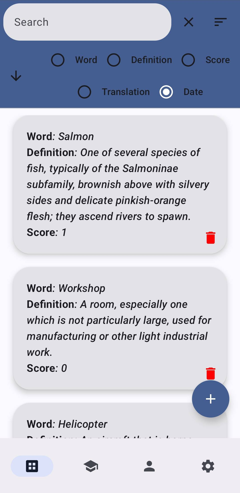
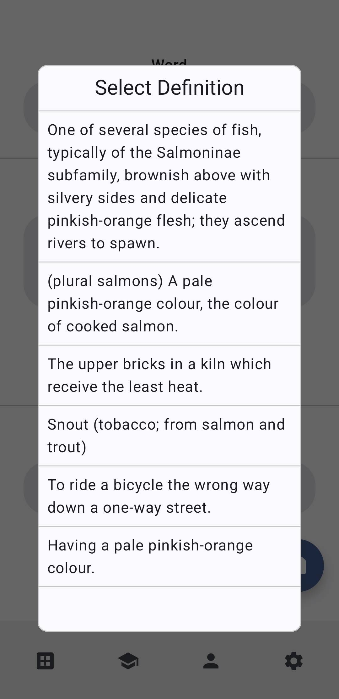
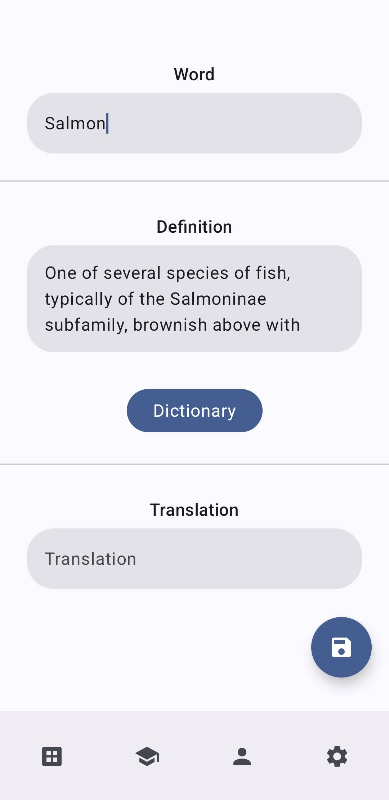
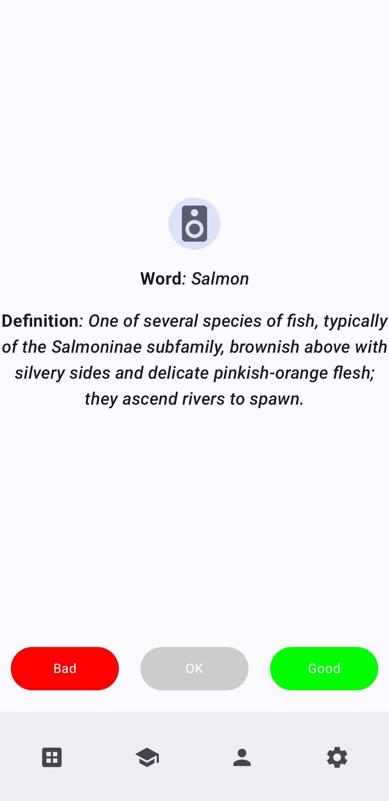
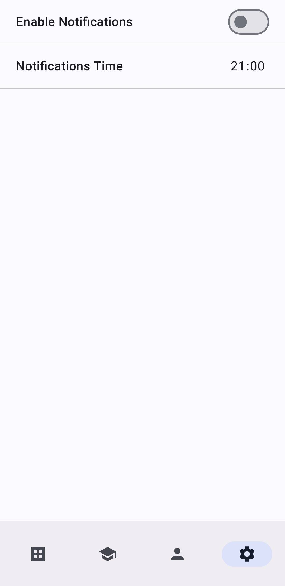
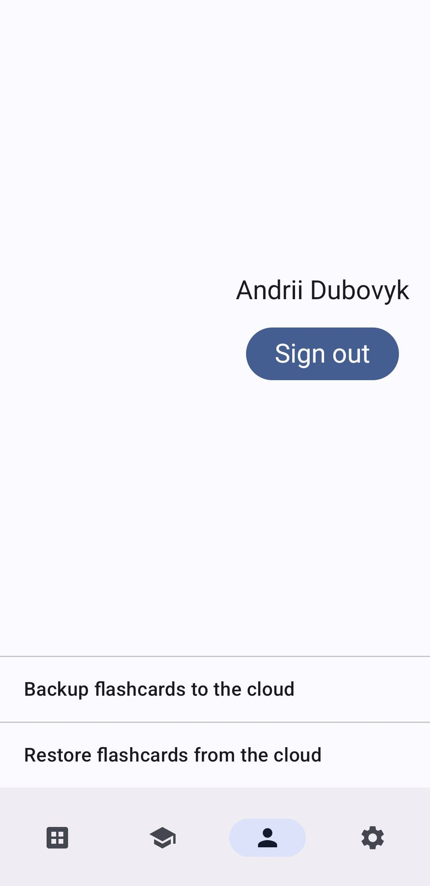

EasyLex is a simple and powerful app to help you learn English using flashcards. Create your own cards with words, definitions, and translations. 
Easily select definitions from an online dictionary to save time. Practice your cards to remember meanings or translations, and improve your listening skills with audio pronunciations. 
Stay motivated with daily reminders, and keep your progress safe with cloud backups. Whether you’re a beginner or advanced learner, EasyLex makes learning English easy and fun!
[Download](release/EasyLex.apk)

  
  
  
  
  
  

